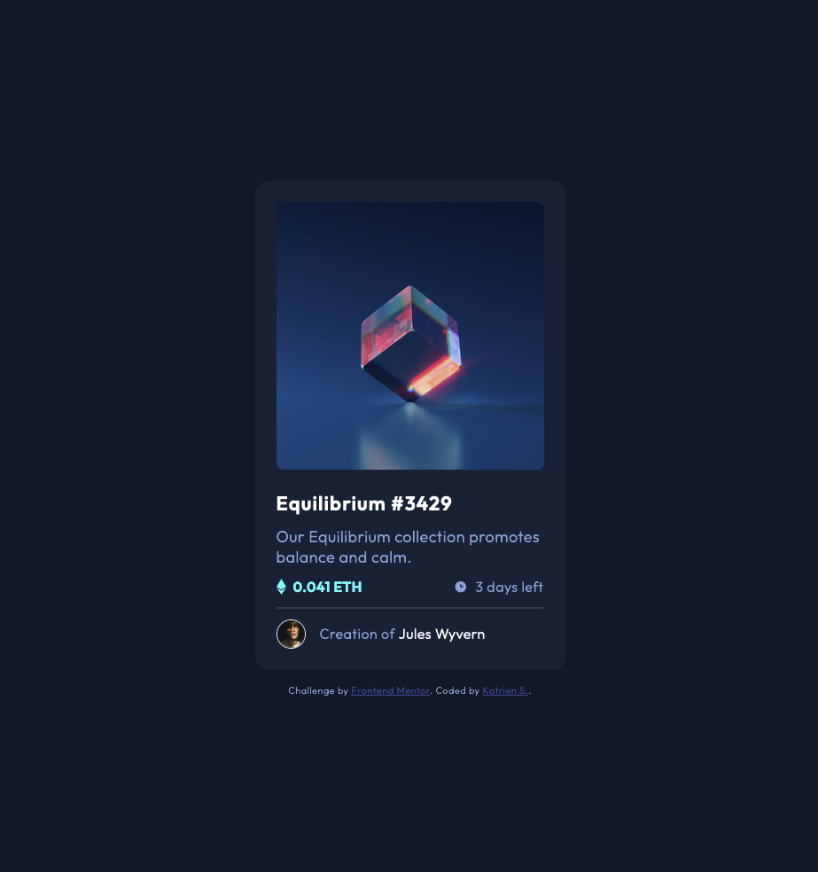

# Frontend Mentor - NFT preview card component solution

This is a solution to the [NFT preview card component challenge on Frontend Mentor](https://www.frontendmentor.io/challenges/nft-preview-card-component-SbdUL_w0U). Frontend Mentor challenges help you improve your coding skills by building realistic projects. 

## Table of contents

- [Overview](#overview)
  - [The challenge](#the-challenge)
  - [Screenshot](#screenshot)
  - [Links](#links)
- [My process](#my-process)
  - [Built with](#built-with)
  - [What I learned](#what-i-learned)
  - [Continued development](#continued-development)
  - [Useful resources](#useful-resources)
- [Author](#author)

## Overview

### The challenge

Users should be able to:

- View the optimal layout depending on their device's screen size
- See hover states for interactive elements

### Screenshot

### Links

- Solution URL: [Add solution URL here](https://your-solution-url.com)
- Live Site URL: [Add live site URL here](https://your-live-site-url.com)

## My process

### Built with

- Semantic HTML5 markup
- CSS custom properties
- Flexbox
- Mobile-first workflow

### What I learned

The past month, I've been repeating a lot of theory. This has helped me to understand the concepts behind html and css a lot more. In solving this challenge, I was more aware of each decision I made.

### Continued development

I need to learn how to work with svg's. I also need to get used to work with positioning. I'm at the moment struggling to put that theory in practice. Which just means, I need to practice a lot more.

### Useful resources

- [StackOverflow](https://stackoverflow.com/questions/40292168/color-overlay-on-hover-image) - Somehow I couldn't get `background-blend-mode` to work, so I looked for a solution on Stackoverflow. Hoping it would also work on the svg. I adapted the solution to this excercise and managed to get the overlay to work.

## Author

- Website - [www.katriens.be](https://www.katriens.be)
- Frontend Mentor - [@graficdoctor](https://www.frontendmentor.io/profile/graficdoctor)
- Twitter - [@graficdoctor](https://www.twitter.com/graficdoctor)